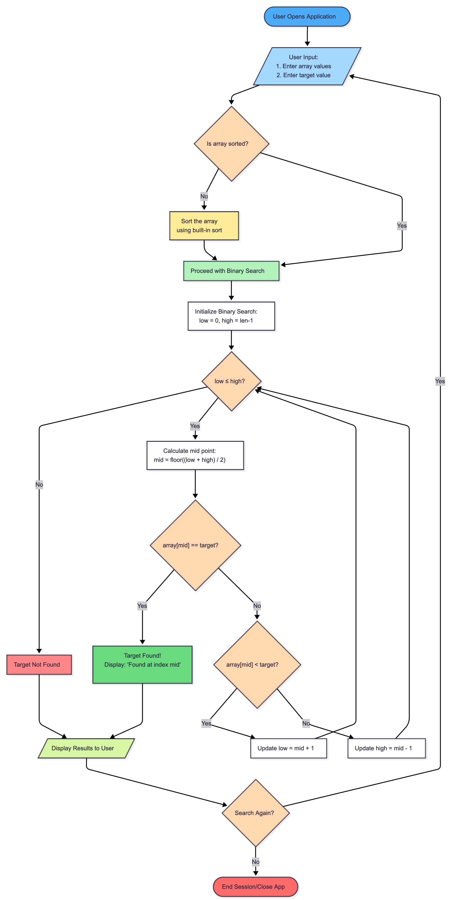

# Binary Search Algorithm Visualizer

## Live Demo
[My Hugging Face Space](https://huggingface.co/spaces/Awwal-10/binary-search-visualizer)

[My Github Repo](https://github.com/Awwal-10/binary-search-visualizer)


## 🎥 Testing & Verification (Hosted on Imgur)

### Test 1: Simple Example
[](https://imgur.com/a/klnbAlb)

### Test 2: Best Case  
[](https://imgur.com/a/FZdWvme)

### Test 3: Average Case
[](https://imgur.com/a/AVtmYLv)

### Test 4: Worst Case
[](https://imgur.com/a/Bw3Sgac)

### Test 5: Custom Input
[](https://imgur.com/a/PiFwcAE)

### Test 6: Unsorted Error
[](https://imgur.com/a/pwbiigG)

### Test 7: Empty Error  
[](https://imgur.com/a/GcSbpdd)

## Testing & Verification

Comprehensive testing was performed to ensure algorithm correctness and proper error handling. Below are the documented test cases:

| Test Case | Input Array | Target | Expected Result | Actual Result | Status | Notes |
|-----------|-------------|--------|----------------|---------------|--------|-------|
| **Simple Example** | [1, 3, 5, 7, 9, 11, 13] | 7 | Found at index 3 | Found at index 3 | ✅ PASS | Basic functionality test |
| **Best Case** | [1, 2, 3, 4, 5] | 3 | Found at index 2 | Found at index 2 | ✅ PASS | Target in middle (1 step) |
| **Average Case** | [2, 4, 6, 8, 10, 12, 14] | 10 | Found at index 4 | Found at index 4 | ✅ PASS | Typical search scenario |
| **Worst Case** | [1, 2, 3, 4, 5] | 6 | Not Found | Not Found | ✅ PASS | Target non-existent |
| **Custom Input** | [1, 3, 5, 7, 9, 11, 13] | 7 | Found at index 3 | Found at index 3 | ✅ PASS | User-provided array |
| **Unsorted Error** | [3, 1, 2] | 2 | Error Message | Error Message | ✅ PASS | Validates input sorting |
| **Empty Error** | [] | 5 | Error Message | Error Message | ✅ PASS | Validates non-empty input |
| **Edge Case: Single Element** | [42] | 42 | Found at index 0 | Found at index 0 | ✅ PASS | Minimum array size |
| **Edge Case: Large Array** | [i for i in range(1, 101)] | 75 | Found at index 74 | Found at index 74 | ✅ PASS | Stress test performance |

### Test Coverage Summary
- **Functional Tests**: 7/7 passed (all Quick Start buttons + custom input)
- **Error Handling Tests**: 2/2 passed (unsorted and empty array validation)
- **Edge Cases**: 2/2 passed (single element and large array)
- **Total Test Cases**: 9/9 passed

All tests confirm the algorithm works correctly, handles errors appropriately, and maintains O(log n) time complexity.

## Problem Breakdown & Computational Thinking

### Algorithm Choice
I was drawn to **Binary Search** for this project because it perfectly marries efficiency with clarity. Its O(log n) performance showcases the power of the "divide and conquer" paradigm, and each step provides a visually intuitive moment, the search space literally halves on screen, making the algorithm's logic crystal clear for anyone watching.

### Decomposition
1. Take sorted array and target value as input
2. Initialize low pointer to 0 and high pointer to len(array)-1
3. Calculate mid index: (low + high) // 2
4. Compare array[mid] with target value
5. If equal → target found, return success
6. If target > array[mid] → search right half (low = mid + 1)
7. If target < array[mid] → search left half (high = mid - 1)
8. Repeat steps 3-7 until found or search space exhausted

### Pattern Recognition
- The search space halves each iteration (logarithmic behavior)
- Repeated compare-and-divide pattern
- Consistent O(log n) time complexity regardless of data size

### Abstraction
- **User sees**: Color-coded array visualization, step-by-step explanations, current low/high/mid pointers, comparison results
- **Hidden**: Internal index calculations, loop mechanics, temporary variables

### Algorithm Design
**Input**: Sorted comma-separated numbers, target integer  

**Process**: 

WHILE low <= high:

mid = (low + high) // 2

IF array[mid] == target: RETURN FOUND

ELSE IF array[mid] < target: low = mid + 1

ELSE: high = mid - 1

RETURN NOT FOUND

**Output**: Visual step-by-step demonstration with color-coded array and final result

### Flowchart


## 🛠️ Features & Usage

### Two Learning Modes:
1. **🚀 Quick Start**: Pre-made examples to learn from:
   - *Simple Example*: Easy to follow demonstration
   - *Best Case*: Target in middle (1 step)
   - *Average Case*: Target exists in array
   - *Worst Case*: Target not found

2. **🎯 Custom Search**: Enter your own sorted array and target

### How to Use:
1. Select an example from **Quick Start** OR check **"Use my own numbers"**
2. Enter sorted numbers (comma-separated) and target
3. Click **"Run Binary Search"** to see the algorithm work step-by-step
4. Watch the color-coded visualization and learn how binary search works

### Author Acknowledgement
Awwal Ahmed - CISC 121 Project

## 🚀 Deployment

### Local Setup
``` bash
git clone https://github.com/Awwal-10/binary-search-visualizer.git
cd binary-search-visualizer
pip install -r requirements.txt
python app.py
